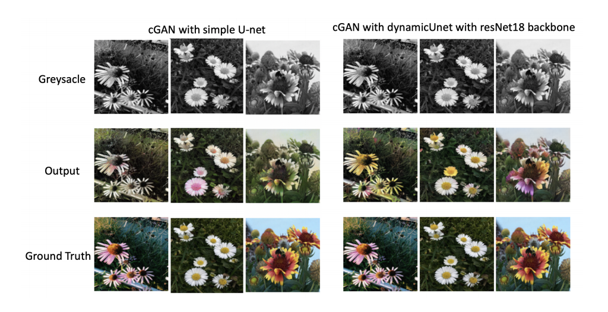
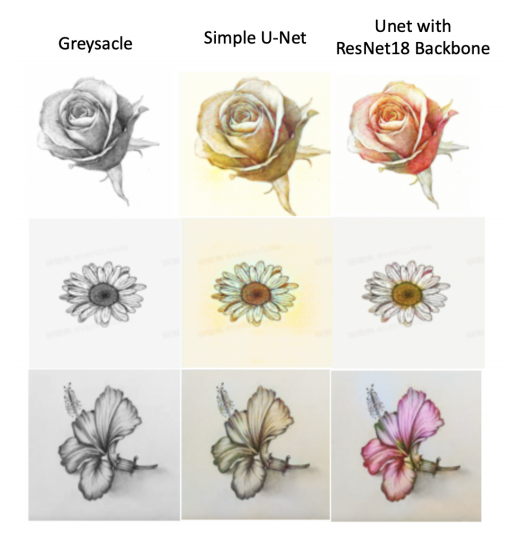

# Auto Colorization with cGANs
Yih CHENG (https://github.com/chengyih001) 
Yao ZHANG (https://github.com/cyiu-yoyo)

Project Detail and Summary : https://github.com/chengyih001/GAN_Auto_Colorization/blob/master/paper/Auto%20Colorization%20with%20cGANs.pdf

## Overview
Image translation has been one of the most popular topics in computer vision, and approaches aiming to study the mapping function between input images and output images have been one of the main focuses toward this problem. In this project, the target is to colorize grayscale flower images with large, deep conditional GAN (cGAN) architecture. 

## Results

  
  

## Problem Description
Given an input grayscale image _`xi`_ `∈ [0, 255]` m\*n\*3 in domain X, the corresponding colorized image output is _`yi`_ `∈ [0, 255]` m\*n\*3 in domain Y, with m being the image height, n being the image width, and 3 representing the three `RGB` channels. The goal for this project is to implement a model that can learn the mapping function `GXY : X → Y` , which is capable of generating output images `GXY (X)` that are indistinguishable from the ground-truth images Y.

## Implementation
 

A cGAN consists of one generator and one discriminator. Working in `CIELAB` color space, the generator generates the `ab` channels of a `L` channel input image. The concatenation of `L` and `ab` channels is then the colorized version of the input image. The discriminator is used to check whether the generated colorful image is real (ground-truth) or fake (generated). To find a more efficient and high-quality method, two versions of the generator were implemented. The first one uses a U-net structure that includes 8 U-net blocks for the encoder and 8 U-net blocks for the decoder. Each encoder U-net block includes a convolutional layer followed by a batch normalization layer and an activation layer. Dropout layer is also implemented to reduce overfitting and improve generalization errors. For decoder U-net blocks, each includes a deconvolutional layer followed by a batch normalization layer and a 'ReLu' activation layer. In addition, the 'ReLu' activation layer for the last U-net block in the decoder is replaced by a 'Tanh' activation layer. In the second generator implementation, Dynamic U-Net from fastai library, a structured 'U-Net' with 'ResNet18' as backbone from torchvision library was utilized. For the discriminator, it is composed of three Conv-BatchNorm-LeakyReLU blocks. No normalization is used in the first block, while neither normalization nor activation function is implemented in the last block.

## Dataset
The dataset in this project consists of a specific object category, flowers, since the color distribution will be more similar than images from random object categories. For instance, flowers are more likely be in colors of yellow, red or white, instead of colors such as black or blue, which however might be quite common in images of sneakers. To simplify the task and make the process more efficient, the images are first converted from `RGB` color space into `CIELAB` color space, and then split into `L` channel and `ab` channel. Switching to `CIELAB` color space rather than working on `RGB` color space allows less training to be performed, as there will be 256^3 ≈ 16,800,000 possibilities for every pixel that requires the generator to predict. However, in the `Lab` color space, the possibilities for every pixel are greatly decrease to 256^2 ≈ 65,000. After converting to `CIELAB` color space, `L` channel images are then converted into _`xi`_ `∈ [-1,1]` m\*n\*1 and `ab` channel images into _`yi`_ `∈ [-1,1]` m\*n\*2. In order to reproduce the original image, the concatenated `L` channel input and the generated `ab` channels output from `CIELAB` color space are converted back to `RGB` color space.
